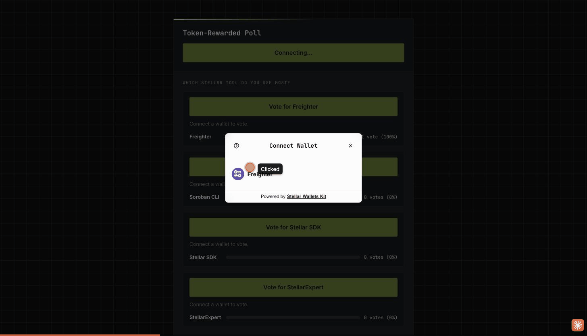
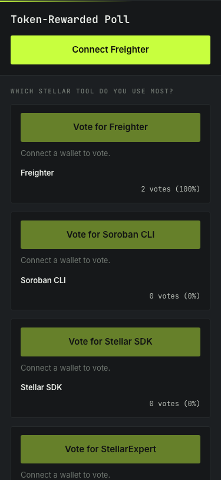
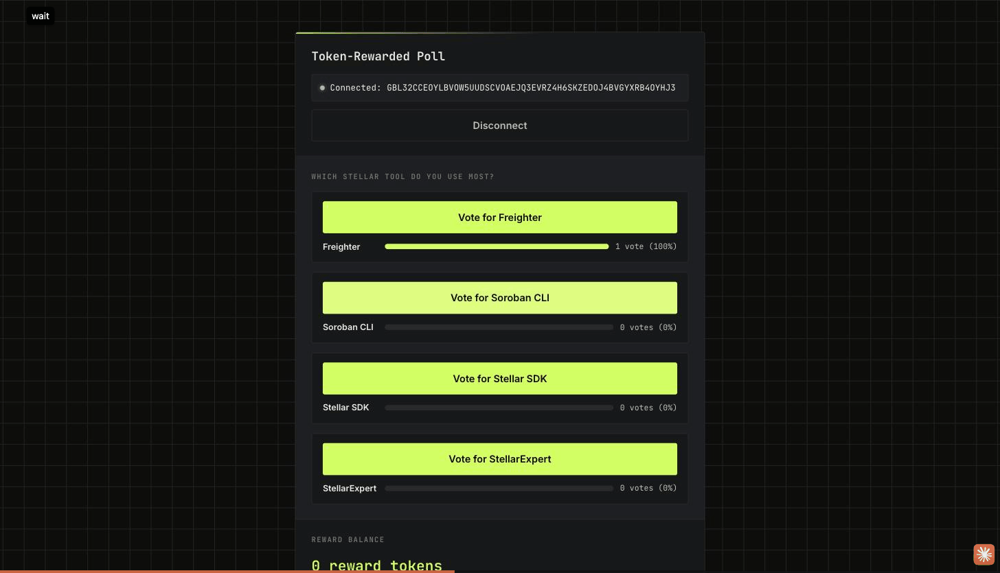
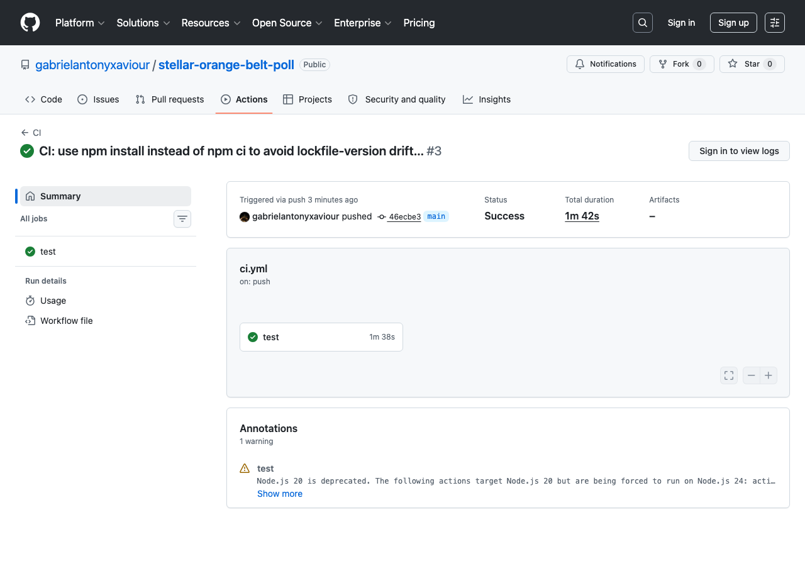

# Token-Rewarded Poll — Stellar Soroban dApp

A production-shaped Soroban dApp built for **Level 3 – Orange Belt** of RiseIn's [Stellar Journey to Mastery](https://www.risein.com/programs/stellar-journey-to-mastery-monthly-builder-challenges) monthly builder challenge.

Two real smart contracts, wired together with a genuine **inter-contract call**: voting on the `poll` contract triggers `poll` to invoke the `reward-token` contract's `mint` function, crediting the voter with 1 reward token — all in a single atomic transaction.

**Live demo:** https://stellar-orange-belt-poll.pages.dev



## Deployed contracts (Stellar Testnet)

| | |
|---|---|
| **Poll contract** | [`CAYVSLWRCT66VGMCNGLZJLVXJWJ5KC5FZYSHBDAJQALH5L2562XQTWFZ`](https://stellar.expert/explorer/testnet/contract/CAYVSLWRCT66VGMCNGLZJLVXJWJ5KC5FZYSHBDAJQALH5L2562XQTWFZ) |
| **Reward-token contract** | [`CDQEDAPJPDRVH6BORTSUUJOPPHWDBQYQD6TWC5ZDQSR3QT4LMQDQ2YK6`](https://stellar.expert/explorer/testnet/contract/CDQEDAPJPDRVH6BORTSUUJOPPHWDBQYQD6TWC5ZDQSR3QT4LMQDQ2YK6) |
| **Poll id** | `1` — "Which Stellar tool do you use most?" (Freighter / Soroban CLI / Stellar SDK / StellarExpert) |

### Transaction history (all verifiable on Stellar Expert)

| Step | Tx hash |
|---|---|
| Deploy reward-token | [`bf0f94ade87535bc2f2c8b1fb0d16e5cfb1cc80b501f0443a7793a9c5c677c6a`](https://stellar.expert/explorer/testnet/tx/bf0f94ade87535bc2f2c8b1fb0d16e5cfb1cc80b501f0443a7793a9c5c677c6a) |
| Deploy poll | [`da117b8a208d5e1281d266c26f6a6ebd348c56e41613e43e6f468c3308817471`](https://stellar.expert/explorer/testnet/tx/da117b8a208d5e1281d266c26f6a6ebd348c56e41613e43e6f468c3308817471) |
| `set_minter` (authorize poll to mint) | `40bc72fb05f198dcef1d12d0208d6541790b2b33f491d66bfe4491884dddc3d4` |
| `set_reward_token` (wire poll → reward-token) | `49a7e7a5b30213fb4b32789e597417cf294ea67b2108d3b1b16dbc13371bdb06` |
| `create_poll` (init poll 1) | `e4918f5a48857cb8be1221f153ee4bf46c364b96b4778fe35f6894914d44edac` |
| CLI verification vote (proves the inter-contract mint) | [`7f01920deb3a257324a17d01c69682193003f1051e80df4afa1080e82b3df323`](https://stellar.expert/explorer/testnet/tx/7f01920deb3a257324a17d01c69682193003f1051e80df4afa1080e82b3df323) |
| **Real browser vote** (Freighter, via the live frontend) | [`430c637ea1474fdf0e4ac42a6c95817ddc527a613d7f7314714b58220a0e326b`](https://stellar.expert/explorer/testnet/tx/430c637ea1474fdf0e4ac42a6c95817ddc527a613d7f7314714b58220a0e326b) |

Every vote above independently increased the voter's reward-token balance via the inter-contract `mint` call — confirmed by reading `balance` on the reward-token contract after each vote.

## Features

- **Two Soroban contracts, one atomic cross-contract call.** `poll.vote()` calls `reward-token.mint()` directly from within the same transaction — this is the "inter-contract communication" requirement, not simulated.
- **Real-time results.** The frontend polls `get_results` every few seconds so vote counts stay in sync across all connected clients.
- **Reward balance display** for the connected wallet, refreshed after every vote.
- **Transaction status tracking**: pending → success (hash + Stellar Expert link) or a clear failure message.
- **3 distinct error states handled**: wallet not found/not installed, connection rejected, and contract-level rejection (double-vote / expired transaction), each decoded from the raw Soroban XDR result into a human-readable message — never a raw base64 blob.
- **Mobile responsive.** The layout reflows to a single column with stacked results rows under 480px.





**Demo video (~72s):** [`docs/demo/walkthrough.mp4`](docs/demo/walkthrough.mp4) — the live deployed site (connect wallet → live on-chain results → reward balance) → the GitHub repo (README, deployed contract IDs, tx history table) → the passing CI run with the full step list and Vitest summary. Recorded against the deployed testnet contracts and the actual repo, not a mock.

## Tests

**Soroban contract tests (Rust, `cargo test`) — 5 passing:**

```
running 3 tests (poll)
test test::vote_records_correctly_and_increments_selected_option ... ok
test test::double_vote_from_same_address_rejects - should panic ... ok
test test::vote_mints_a_reward_token_via_inter_contract_call ... ok
test result: ok. 3 passed; 0 failed

running 2 tests (reward-token)
test test::minter_cannot_be_changed_after_it_is_set - should panic ... ok
test test::admin_sets_minter_once_and_minter_mints_balance ... ok
test result: ok. 2 passed; 0 failed
```

**Frontend tests (Vitest) — 6 passing:**

```
 Test Files  2 passed (2)
      Tests  6 passed (6)
```

## CI/CD

`.github/workflows/ci.yml` runs on every push/PR:
1. `cargo test` for the Soroban contract workspace
2. `npm install && npm run build && npm run test` for the frontend

See the [Actions tab](../../actions) for live runs.



## Tech stack

- Rust + [`soroban-sdk`](https://developers.stellar.org/docs/build/smart-contracts) for both contracts
- Vite + React + TypeScript for the frontend
- [`@creit.tech/stellar-wallets-kit`](https://github.com/Creit-Tech/Stellar-Wallets-Kit) for wallet connect
- [`@stellar/stellar-sdk`](https://www.npmjs.com/package/@stellar/stellar-sdk) for building/submitting transactions and reading contract state
- [Vitest](https://vitest.dev/) + Testing Library for frontend tests
- Deployed to [Cloudflare Pages](https://pages.cloudflare.com/)

## Project structure

```
contracts/
├── poll/src/lib.rs           # create_poll, vote (calls reward-token.mint), get_results
└── reward-token/src/lib.rs   # set_minter, mint, balance

src/
├── App.tsx
├── components/
│   ├── WalletConnect.tsx
│   ├── PollCard.tsx / ResultsBar.tsx / VoteButton.tsx
│   ├── RewardBalance.tsx
│   └── TxStatus.tsx
├── lib/
│   ├── wallet-kit.ts      # StellarWalletsKit wrapper
│   ├── contract.ts        # get_results / vote / getRewardBalance against the deployed contracts
│   ├── errors.ts          # XDR TransactionResult decoding → human-readable messages
│   ├── results.ts / events.ts
│   └── *.test.ts          # Vitest unit tests
└── test/setup.ts
```

## Setup — run it locally

**Prerequisites**

- Node.js 18+
- [Freighter](https://www.freighter.app/) browser extension, testnet network, funded with testnet XLM

**Install & run**

```bash
npm install
npm run dev
```

The app talks directly to the already-deployed contracts above — no redeploy needed to try it.

**Build & test**

```bash
npm run build
npm run test
```

### Rebuilding / redeploying the contracts (optional)

The Soroban wasm target requires `wasm32v1-none`, not `wasm32-unknown-unknown` — the newer target avoids a `reference-types not enabled` wasm validation error against Soroban's current VM:

```bash
rustup target add wasm32v1-none
cd contracts
stellar contract build
stellar contract deploy --wasm target/wasm32v1-none/release/reward_token.wasm --source <identity> --network testnet -- --admin <admin-address>
stellar contract deploy --wasm target/wasm32v1-none/release/poll.wasm --source <identity> --network testnet -- --admin <admin-address>
# then wire them together:
stellar contract invoke --id <reward-token-id> --source <identity> --network testnet --send=yes -- set_minter --minter <poll-id>
stellar contract invoke --id <poll-id> --source <identity> --network testnet --send=yes -- set_reward_token --address <reward-token-id>
stellar contract invoke --id <poll-id> --source <identity> --network testnet --send=yes -- create_poll --question "..." --options '["A","B"]'
```

Update `POLL_CONTRACT_ID` / `REWARD_TOKEN_CONTRACT_ID` in `src/lib/config.ts` with the new addresses.

## Usage

1. Click **Connect Freighter** and approve the connection.
2. The current poll question, options, and live vote counts load from the contract.
3. Click **Vote for &lt;option&gt;** and approve the transaction in Freighter.
4. On success: the transaction status shows the hash + Stellar Expert link, the results update, and your reward-token balance increases by 1 — proving the inter-contract call actually ran.
5. Voting again from the same address is blocked both in the UI and by the contract itself (`AlreadyVoted`), surfaced as a clear message rather than a raw error code.
